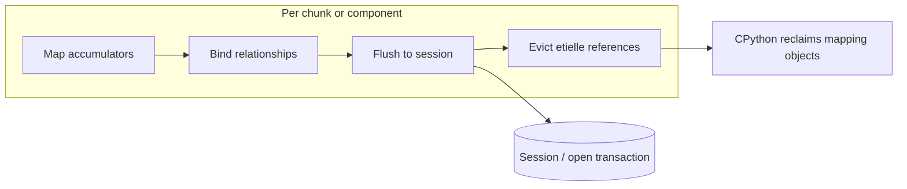
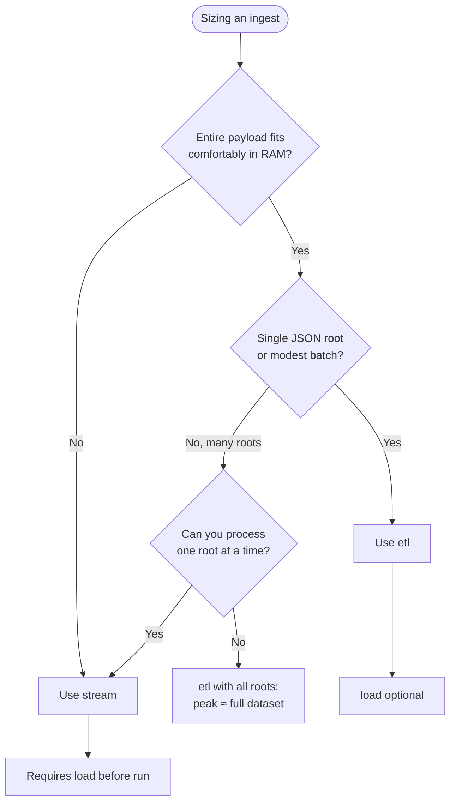
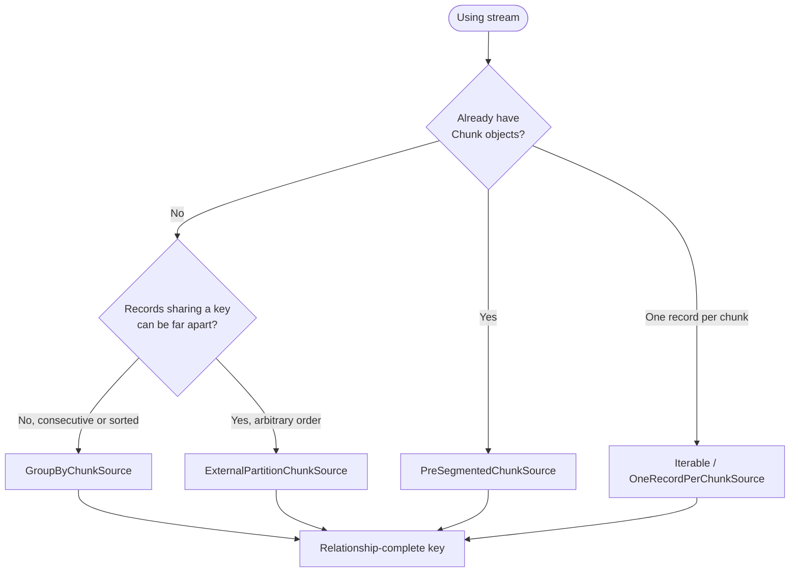
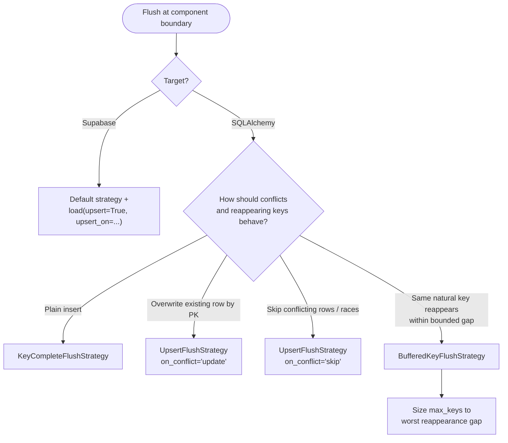

**What you'll learn**: What etielle holds in memory at each execution phase, when to use resident (`etl()`) versus streaming (`stream()`) execution, how to choose a chunk source and flush strategy, and what memory bounds etielle does *not* provide.

For session setup, transactions, Supabase configuration, and persistence mechanics, see [Database Loading](database-loading.qmd).

## Mental model: what lives in memory

Every pipeline run moves data through the same phases. Understanding what is retained at each step is the key to sizing your ingest.

| Phase | What etielle holds | When it is released |
|-------|-------------------|---------------------|
| **Map** | Per-table `MappingResult` accumulators (instances, indices, lookup values) | After flush and evict (streaming), or after each component cycle (resident) |
| **Bind** | Same objects with relationship attributes populated | Same as map |
| **Flush** | ORM instances in the session plus etielle's scoped references | etielle drops its references after flush; the session retains flushed rows until you commit |
| **Resident eager** | `load_eager()` tables mapped once and kept in `bind_context` | Entire run (by design) |
| **Strategy state** | e.g. `BufferedKeyFlushStrategy` LRU cache of recently flushed keys | Entire run, bounded by `max_keys` |
| **External partition spill** | Temporary file plus in-memory offset index | Until chunk iteration finishes or the iterator is closed |



**Key takeaway:** etielle bounds **mapping accumulator** memory. It does **not** bound session or transaction size, strategy cache size, resident eager tables, or external-partition disk usage. You control transaction scope via `session.commit()`.

## Resident execution (`etl()`)

Resident mode loads your JSON root(s) once and maps the full payload in memory:

```python
from etielle import etl

result = (
    etl(data)
    .goto("users").each()
    .map_to(table=User, fields=[...])
    .load(session)
    .run()
)
```

### Component-scoped flush and evict

Pipelines with relationships are executed as independent **relationship components** (weakly connected subgraphs of the `link_to`/`backlink` graph). Each component is mapped, bound, flushed, and evicted before the next component runs.

Peak mapping memory is bounded by the **largest component**, not necessarily the entire dataset — but only when the relationship graph splits cleanly. Tables with no relationship edges are batched into a single mapping pass for efficiency.

### When resident mode is enough

- The full JSON payload fits comfortably in RAM.
- You have a single root or a modest number of roots you can hold at once.
- The relationship graph decomposes into reasonably sized components.

### Shared dimensions and `load_eager()`

When a shared dimension table (e.g. `tags`) is referenced by many independent subgraphs, the relationship graph collapses into one giant component and the per-component memory win vanishes. Mark small shared tables as eager so they are loaded once and kept resident while other components are processed:

```python
result = (
    etl(data)
    .goto("tags").each()
    .map_to(table=Tag, fields=[...])
    .load_eager(Tag)          # resident across all components
    .goto_root()
    .goto("items").each()
    .map_to(table=Item, fields=[...])
    .link_to(Tag, by={"tag_id": "id"})
    .load(session)
    .run()
)
```

Resident eager tables stay in memory for the entire run. Size them for tables that are small relative to your fact data.

## Streaming execution (`stream()`)

For large or single-consumption inputs (paginated APIs, `ijson` streams), use `stream()` instead of `etl()`. Streaming processes **key-complete, relationship-complete** chunks: each chunk is mapped, validated, bound, flushed, and evicted before the next chunk begins.

```python
from etielle import stream

result = (
    stream(record_iter)
    .goto("users").each()
    .map_to(table=User, fields=[...])
    .load(session)   # required in streaming mode
    .run()
)
session.commit()
```

Peak mapping memory is approximately **one chunk** plus any resident `load_eager()` tables — flat regardless of total dataset size. The benchmark in `benchmarks/bench_issue_75.py` demonstrates Python heap peak staying flat under streaming while resident loading grows with the dataset:

```bash
uv run python benchmarks/bench_issue_75.py --scale 2000
```

### Streaming requirements

- `load()` is required before `run()` in streaming mode.
- Each chunk must include all relationship endpoints, or use `load_eager()` for shared parents present in every chunk.
- Cross-chunk scattered merge (e.g. merging `users` and `profiles` from different chunks) is not supported.
- Traversal-based `build_index()` and composite `by` mappings on `link_to()` are rejected.

Pass resident eager data via `eager_roots=` when dimension tables are not repeated in every chunk:

```python
stream(chunks, eager_roots=tags_snapshot)
    .goto("tags").each()
    .map_to(table=Tag, fields=[...])
    .load_eager(Tag)
    ...
```

### SQLAlchemy session behavior

Once etielle drops its per-chunk references after flush, CPython's garbage collector reclaims mapping objects. The session's identity map references persistent (flushed, clean) instances weakly, so no special cleanup is required on the SQLAlchemy side.

Transaction control still belongs to you: `INSERT`s accumulate in the open transaction until you commit or roll back. For very long streams, commit at a cadence that suits your durability needs; a single end-of-stream commit keeps everything in one transaction but grows the session's transaction scope.

## Choosing an execution mode



## Choosing a chunk source

Chunk sources are only relevant for `stream()`. Producing correct chunks is part of the streaming contract — each chunk must be key-complete and relationship-complete. See [Relationships](relationships.qmd) for how `link_to` shapes the component graph.

::: {.callout-important}
## Pick a relationship-complete key

Whether you group with `GroupByChunkSource` or partition with `ExternalPartitionChunkSource`, choose a key that is a **complete component root** — coarse enough that every record reachable through a relationship from one record sharing the key also shares it (e.g. the owning entity id), not merely a fine merge key. Grouping guarantees key-completeness for the chosen key; the runtime relationship-completeness check catches a key that is too fine.
:::



| Chunk source | When to use | Record RAM | Other cost |
|--------------|-------------|--------------|------------|
| **Iterable / `OneRecordPerChunkSource`** | One JSON root per chunk; simplest streaming shape | One record | None |
| **`GroupByChunkSource`** | Input is grouped or sorted by key; consecutive records with the same key arrive together | One chunk (current key group) | Single pass, no disk |
| **`ExternalPartitionChunkSource`** | Keys can reappear arbitrarily far apart; input is unsorted | One chunk (current partition) | Full-dataset temp file + offset index |
| **`PreSegmentedChunkSource`** | You already produce `Chunk` objects with known boundaries | Whatever the upstream holds | None (passthrough) |

### `GroupByChunkSource`

Single-pass group-by over consecutive records:

```python
from etielle import stream, GroupByChunkSource

source = GroupByChunkSource(record_iter, key=lambda r: r["orders"][0]["id"])
stream(source).goto(...)...
```

Grouping is **consecutive only**. If two records share a key but are separated by a record with a different key, they land in separate chunks. That still satisfies key-completeness, but the relationship-completeness check will raise if a chunk is then missing endpoints. For unsorted input, use `ExternalPartitionChunkSource` instead.

### `ExternalPartitionChunkSource`

Two-pass disk-backed partitioner for arbitrarily ordered input. Pass one serializes every record to a temporary spill file and builds a key→offsets index; pass two emits one chunk per distinct key by reading records back from disk:

```python
from etielle import stream, ExternalPartitionChunkSource

source = ExternalPartitionChunkSource(record_iter, key=lambda r: r["orders"][0]["id"])
stream(source).goto(...)...
```

- Peak **record** memory is one chunk; the **full dataset** is written to temp storage.
- The offset index holds a few machine words per record for the duration of the stream.
- Pass two performs random reads — prefer a fast local temp filesystem (`dir=` overrides the location).
- Records round-trip through `dumps`/`loads` (default JSON); chunks yield reconstructed copies.

### `PreSegmentedChunkSource`

Passthrough when you already have an iterable of `Chunk` objects:

```python
from etielle import stream, PreSegmentedChunkSource, Chunk

chunks = [Chunk(roots=(subtree,), sequential=True) for subtree in producer]
stream(PreSegmentedChunkSource(chunks)).goto(...)...
```

## Choosing a flush strategy

The chunk loop calls `FlushStrategy.flush(ctx)` at each component boundary. Pass a strategy via `stream(..., flush_strategy=...)` or `etl(..., flush_strategy=...)`.



| Strategy | Cross-chunk state | Use when |
|----------|-------------------|----------|
| **`KeyCompleteFlushStrategy`** (default) | None | Clean inserts; duplicate keys against stored rows raise `IntegrityError` |
| **`UpsertFlushStrategy`** | None (DB resolves) | Re-runs when all tables have mappable PKs (`update`) or skip-on-conflict ingest (`skip`); SQLAlchemy only |
| **`BufferedKeyFlushStrategy`** | LRU cache of `max_keys` entries | Late-arriving rows for the same `join_on` key within a bounded reappearance gap; SQLAlchemy only |

### `KeyCompleteFlushStrategy`

Default behavior: plain `session.add()` and flush with no cross-chunk state. Delegates to etielle's standard insert and relationship-binding logic.

### `UpsertFlushStrategy`

Database-level conflict handling for SQLAlchemy (real upsert via `session.merge()`, not `add()`):

```python
from etielle import stream, UpsertFlushStrategy

stream(records, flush_strategy=UpsertFlushStrategy())                    # overwrite by PK
stream(records, flush_strategy=UpsertFlushStrategy(on_conflict="skip"))    # skip conflicts
```

::: {.callout-important}
## PK keys required for idempotent re-runs

`UpsertFlushStrategy(on_conflict="update")` deduplicates rows only when etielle can supply a **mappable primary key** at flush time — typically via `join_on` on `map_to()` or natural keys populated before merge. Tables mapped without `join_on` (auto-increment or DB-generated PKs) are inserted as **new rows on every run**, even when parent rows merge correctly. For idempotent re-runs across **all** tables in the pipeline, ensure every table you expect to dedupe has keys mapped before flush.
:::

- **`update`** (default): `session.merge()` — existing rows with the same primary key are overwritten (last write wins). Applies per table: only rows with primary key values participate in merge; auto-keyed child rows accumulate on each re-run.
- **`skip`**: per-row `SAVEPOINT` insert; rows raising `IntegrityError` are skipped (duplicate keys, unique constraints, concurrent-insert races). Children bound to a skipped parent are skipped too, because the cascaded parent insert reproduces the conflict inside the child's savepoint.
- Not a cross-chunk merge substitute: merge policies (`AddPolicy` etc.) run only within a chunk's mapping pass.
- For Supabase, use `load(upsert=True, upsert_on=...)` with the default strategy instead.

### `BufferedKeyFlushStrategy`

Bounded LRU cache of recently flushed `(table, join_on key)` → instance entries:

```python
from etielle import stream, BufferedKeyFlushStrategy

stream(records, flush_strategy=BufferedKeyFlushStrategy(max_keys=50_000))
```

When a later chunk maps a row whose key is still cached, non-None scalar values are copied onto the already-persisted instance (an UPDATE at the next flush) instead of inserting a duplicate. Children mapped alongside a re-appearing parent are relinked to the persisted instance.

**Correctness is a heuristic bounded by cache size**, not a guarantee: once a key is evicted, a reappearing row inserts a new row (or raises under a unique constraint). Size `max_keys` for your worst-case reappearance gap, or prefer `ExternalPartitionChunkSource` when keys can be arbitrarily far apart and exact grouping matters.

Only tables with `join_on` participate; auto-keyed rows always insert because auto keys restart per chunk. The strategy is stateful across the run — use a fresh instance per pipeline.

## What etielle does not bound

| Concern | Why |
|---------|-----|
| **Session / transaction size** | Flushed rows accumulate in the open transaction until you `commit()` |
| **`BufferedKeyFlushStrategy` cache** | Up to `max_keys` live ORM instances held for the run |
| **`load_eager()` resident tables** | Entire eager table stays mapped for the run (intentional) |
| **External partition spill** | Full dataset on disk plus offset index (not RAM, but not free) |
| **Cross-chunk scattered merge** | Unsupported by design — not a memory knob, a correctness limit |

## Operational guidance

### Commit cadence

For long streaming runs, periodic `session.commit()` limits transaction scope and session growth. A single end-of-stream commit is simpler but keeps the entire ingest in one transaction. Choose based on durability requirements and database behavior under large open transactions.

### Sizing `max_keys` (buffered strategy)

Estimate the maximum number of distinct `(table, join_on key)` pairs that can reappear before you finish the stream, within the window where late rows still need to merge. If reappearance distance is unbounded or unknown, do not rely on `BufferedKeyFlushStrategy` alone — use `ExternalPartitionChunkSource` to group records correctly before mapping.

### Choosing spill `dir=` (external partition)

Point `ExternalPartitionChunkSource(..., dir=...)` at fast local storage. Pass two reads records back in arbitrary key order; network filesystems add latency without helping correctness.

### Manual batching with `etl()`

Splitting a large dataset into multiple `etl(batch).load(session).run()` calls inside one transaction is a resident pattern. Each batch still peaks at the full batch size in mapping memory. For true flat peak memory over an unbounded stream, use `stream()` with an appropriate chunk source.

## See also

- [Database Loading](database-loading.qmd) — sessions, transactions, Supabase, upsert configuration
- [Relationships](relationships.qmd) — `link_to`, component graphs, relationship-complete chunks
- [Error Handling](error-handling.qmd) — telemetry during mapping and flush
